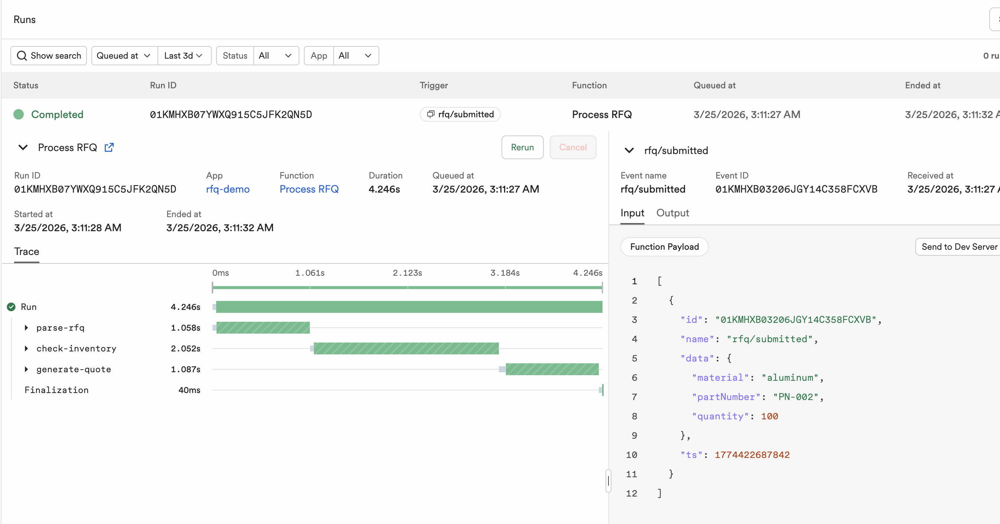

# Inngest Demo

This is a demo app built to understand how Inngest works. It is not production code.

## What it does

Simulates an RFQ (Request for Quote) processing workflow for a manufacturing company using Inngest's durable step functions.

When you submit an RFQ via HTTP, a 3-step workflow runs:

1. **parse-rfq** — validates the incoming request (part number, quantity, material)
2. **check-inventory** — simulates an ERP/warehouse lookup
3. **generate-quote** — calculates pricing, applies a 15% surcharge if backordered

## Stack

- TypeScript + Express
- [Inngest](https://www.inngest.com) for durable step execution

## Running locally

**Terminal 1 — Inngest dev server:**
```bash
npx inngest-cli@latest dev -u http://localhost:3001/api/inngest
```

**Terminal 2 — Express server:**
```bash
PORT=3001 npx ts-node src/server.ts
```

**Trigger a workflow:**
```bash
curl -X POST http://localhost:3001/rfq \
  -H "Content-Type: application/json" \
  -d '{"partNumber":"PN-001","quantity":25,"material":"steel"}'
```

Open `http://localhost:8288` to watch the workflow run step by step.

## Inngest dev UI



## Key files

- `src/server.ts` — Express server, Inngest serve handler, POST /rfq route
- `src/rfq.ts` — Inngest client and the processRfq function with all 3 steps
